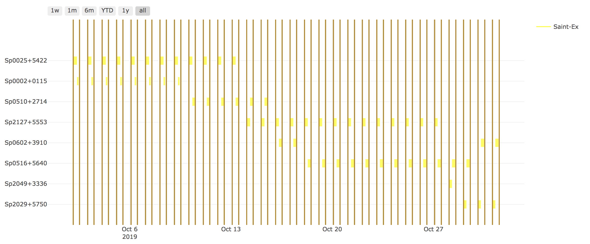

**`SPOCK`** is a Python library for dealing with the planification of SPECULOOS targets observations

*Schedule targets on several criteria:*
*  Visibility of the target
*  Priority (metric from JWST)
*  number of hours already performed

## Installation

Use the package manager [pip]() to install SPOCK.

```bash
pip install SPOCK
```

## Usage

For `long_term_scheduler` reate your *'input_file.csv'* file in the following format:

--- 
--- 
    date_range: 
      - "2019-12-05 15:00:00"
      - "2020-01-08 15:00:00"
    observatories:
      1:
        name: SSO
        telescopes: [Callisto,Europa,Io]
      2:
        name: SNO
        telescopes: [Artemis]
      3: 
        name: Saint-Ex
        telescopes: [Saint-Ex]
      4: 
        name: TS_La_Silla
        telescopes: [TS_La_Silla]
      5: 
        name: TN_Oukaimeden
        telescopes: [TN_Oukaimeden]
    strategy: "continuous"
    duration_segments: 20
    nb_segments: 3
    target_list: speculoos_target_list_v2.txt
---

Then, open a python script or the [SPOCK jupyter notebook]() and run:

```python
import SPOCK.long_term_scheduler as SPOCKLT
schedule = SPOCKLT.schedules()
obs = 1 # 1 for SSO , 2 for SNO and 3 for Saint-Ex
schedule.load_parameters('./input.csv',obs)
schedule.make_schedule(Altitude_constraint = 25, Moon_constraint = 30)
```

To plot the schedule you  have generated, execute the following command:

```
import SPOCK.plots_scheduler as SPOCKplot
from astropy.time import Time
day = Time('2019-11-01 15:00:00.000')
SPOCKplot.airmass_plot_saved('SSO','Ganymede',day)
SPOCKplot.airmass_plot_proposition('SSO','Ganymede',day)
SPOCKplot.airmass_altitude_plot_saved('SSO','Io',day)
SPOCKplot.airmass_altitude_plot_proposition('SSO','Io',day)
SPOCKplot.gantt_chart(day,day+10,['Artemis'])
SPOCKplot.gantt_chart_all(schedule.target_list)

```

Example of output image you will obtain:





## Contributing
Pull requests are welcome. For major changes, please open an issue first to discuss what you would like to change.

Please make sure to update tests as appropriate.

## License

<span style=“color:red;”> text </span>