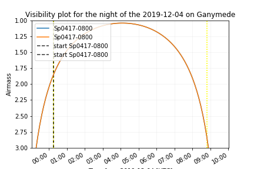

**SPOCK** (Speculoos Observatory SChedule maKer) is a Python library for dealing with the planification of SPECULOOS targets observations

Schedule targets on several criteria:

*  Visibility of the target

*  Priority (from different metrics)

*  number of hours already performed

Documentation for RTD
---------------------

You will find complete documentation for setting up your project at `SPOCK Read
the Docs site`_.

.. _SPOCK Read the Docs site: file:///Users/elsaducrot/spock_2/doc/build/index.html

Installation
---------------------

Use the package manager [git clone]() to install SPOCK::

    git clone http://speculoos7.astro.ulg.ac.be/gitlab/eDucrot/spock.git

    cd spock

Usage
---------------------

For `long_term_scheduler` reate your *'input_file.csv'* file in the following format:

.. jsonschema::
    {
    date_range: 
      - "2020-05-11 15:00:00"
      - "2020-05-31 15:00:00"
    observatories:
      1:
        name: SSO
        telescopes: [Callisto,Europa,Io]
      2:
        name: SNO
        telescopes: [Artemis]
      3: 
        name: Saint-Ex
        telescopes: [Saint-Ex]
      4: 
        name: TS_La_Silla
        telescopes: [TS_La_Silla]
      5: 
        name: TN_Oukaimeden
        telescopes: [TN_Oukaimeden]
    strategy: "continuous"
    duration_segments: 20
    nb_segments: 3
    target_list: speculoos_target_list_v6.txt
    }

Then, open a python script or the [SPOCK jupyter notebook]() and run:

.. code:: ipython3

    import SPOCK.long_term_scheduler as SPOCKLT

    schedule = SPOCKLT.schedules()
    obs = 1 # 1 for SSO , 2 for SNO and 3 for Saint-Ex
    schedule.load_parameters('./input.csv',obs)
    schedule.make_schedule(Altitude_constraint = 25, Moon_constraint = 30)

For `short_term_scheduler` create your *'input_file.csv'* file in the following format:

.. jsonschema::
    {
    day_of_night: 
      - "2019-11-20 15:00:00"
    start_end_range: 
      - "2019-11-21 04:00:00"
      - "2019-11-21 10:30:00"
    use: "follow_up"
    observatories:
      1:
        name: SSO
        telescopes: [Io,Ganymede,Callisto,Io,Europa]
      2:
        name: SNO
        telescopes: [Artemis]
      3: 
        name: Saint-Ex
        telescopes: [Saint-Ex]
      4: 
        name: TS_La_Silla
        telescopes: [TS_La_Silla]
      5: 
        name: TN_Oukaimeden
        telescopes: [TN_Oukaimeden]
    target_list: target_list_special.txt
    }

Then, open a python script or the [SPOCK jupyter notebook]() and run:

.. code:: ipython3

    import SPOCK.short_term_scheduler as SPOCKST
    obs = 2 # 1 for SSO , 2 for SNO and 3 for Saint-Ex
    schedule = SPOCKST.schedules()
    schedule.load_parameters('input_short_term.csv',obs)

    if schedule.use == 'follow_up':
        schedule.transit_follow_up('target_transit_follow_up.txt')
    if schedule.use == 'special_start_end':
        input_name = 'Sp0755-2404'
        schedule.special_target_with_start_end(input_name)
    if schedule.use == 'special':
        input_name = 'Sp0000-1245'
        schedule.special_target(input_name)
    if schedule.use == 'monitoring':
        input_name = 'Sp0755-2404'
        schedule.monitoring(input_name,airmass_max=5,time_monitoring=61)

    schedule.make_scheduled_table()
    schedule.planification()
    schedule.make_night_block()
    SPOCKST.make_np(day=schedule.day_of_night,nb_jours=1,telescope=schedule.telescope)

To plot the schedule you have generated, use the `plots_scheduler` module and execute the following command:

.. code:: ipython3

    import SPOCK.plots_scheduler as SPOCKplot
    from astropy.time import Time

    day = Time('2019-11-01 15:00:00.000')
    SPOCKplot.airmass_plot_saved('SSO','Ganymede',day)
    SPOCKplot.airmass_plot_proposition('SSO','Ganymede',day)
    SPOCKplot.airmass_altitude_plot_saved('SSO','Io',day)
    SPOCKplot.airmass_altitude_plot_proposition('SSO','Io',day)
    SPOCKplot.gantt_chart(day,day+10,['Artemis'])
    SPOCKplot.gantt_chart_all(schedule.target_list)

Example of output image you will obtain:

Contributing
---------------------
Pull requests are welcome. For major changes, please open an issue first to discuss what you would like to change.

Please make sure to update tests as appropriate.

License
---------------------

 text 